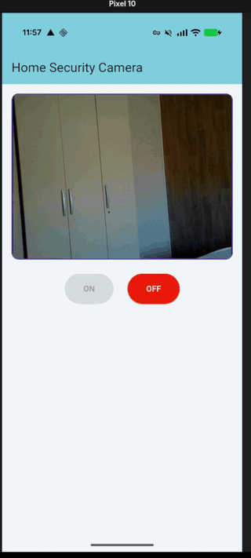

# Home Security Camera

A self-hosted home surveillance system: a Python server runs person detection on a
webcam feed and pushes a notification to a Flutter app the moment someone walks in
front of the camera — even when the app is closed and you are not at home.

No cloud video storage, no third-party camera service, no open port on your router.
The video never leaves your own machine unless you ask for it.

<!-- Demo video / GIF goes here -->
<!--  -->

```
┌──────────────┐   detects a person    ┌──────────────┐   push     ┌──────────┐
│  camera.py   │ ────────────────────▶ │   Firebase   │ ────────▶  │  phone   │
│  (your PC)   │                       │     (FCM)    │            │          │
│              │ ◀──── on/off, status, MJPEG stream ─────────────▶ │          │
└──────────────┘        (over Tailscale, never the open internet)  └──────────┘
```

---

## Contents

- [What it does](#what-it-does)
- [Quick start](#quick-start)
- [Design notes](#design-notes)
- [Security model](#security-model)
- [Requirements](#requirements)
- [Setup](#setup)
- [Running as a service (systemd)](#running-as-a-service-systemd)
- [Configuration](#configuration)
- [API](#api)
- [Project layout](#project-layout)
- [Troubleshooting](#troubleshooting)
- [Known limits](#known-limits)
- [License](#license)

---

## What it does

- **Detects people, not motion.** Background subtraction is only a cheap pre-filter;
  the actual decision is made by a YOLO model, so a curtain moving or a change in
  light does not wake you up at 3am.
- **Notifies you with the app closed.** Push delivery goes through Firebase Cloud
  Messaging, so it does not depend on the app running, or even on your phone being
  on your home network.
- **Streams live video on demand.** The phone can open an MJPEG stream to see what
  is happening, from anywhere.
- **Works away from home.** Reachability is provided by [Tailscale](https://tailscale.com),
  so the server is addressable from your phone over mobile data without exposing
  anything to the internet.
- **Survives reboots and crashes.** Run under systemd it comes back on its own —
  see [Running as a service](#running-as-a-service-systemd).

---

## Quick start

Assuming Firebase, Tailscale and a webcam are already in place (full details in
[Setup](#setup)):

```bash
# 1. one shared secret, used by both sides
KEY=$(python3 -c "import secrets; print(secrets.token_urlsafe(32))")

# 2. server
cd app/camera
CAMERA_API_KEY="$KEY" uv run camera.py
# -> Listening on http://100.x.y.z:5000 (Tailscale only)

# 3. app, pointed at the address printed above
cd ../mobile_app
flutter build apk --release \
  --dart-define=CAMERA_API_KEY="$KEY" \
  --dart-define=CAMERA_BASE_URL='http://100.x.y.z:5000'
```

---

## Design notes

A few decisions in here are more interesting than the feature list:

**Detection lives in the capture thread, not in the HTTP stream.** The naive version
runs the detector inside the MJPEG generator, which means surveillance only happens
while somebody is watching the stream — useless. The camera thread is a *producer*
that detects unconditionally; the video stream is one *optional consumer*.

**Only the newest frame is kept.** The capture thread overwrites `latest_frame`
instead of queueing. A queue would buy nothing and cost latency: what you want from a
security stream is *now*, not a faithful replay of the last four seconds.

**The server is the single source of truth for state.** The app holds no persistent
state of its own: on startup it asks `/status` whether the camera is on. Kill the app,
reopen it, and the UI reflects reality instead of a stale local boolean.

**The FCM device token is persisted to disk.** It is only sent by the app at startup.
Held in memory alone, every server restart would silently disable notifications until
you happened to open the app again — the worst kind of failure for a security system,
because everything looks fine.

**YOLO is gated on motion.** Running inference on every frame of a live stream is far
too slow. Frames below `MOTION_THRESHOLD` skip the model entirely, so an empty room
costs almost nothing.

**Notifications fire on the rising edge.** A person standing in frame is one event, not
thirty per second.

**The camera device is only held open between `on` and `off`.** Not merely a flag:
`stop()` releases the `VideoCapture`, so the hardware LED goes out and the webcam is
genuinely free. A surveillance system you cannot verify is *off* is one you stop
trusting.

**The notification channel is created at app start, not on first use.** A push that
arrives while the app is killed is rendered by Play Services — no Dart code runs — and
Android silently drops any notification whose channel does not exist yet.

**The app says out loud when it cannot alert you.** If notifications are disabled at
the OS level, a permanent red banner says so. Not a SnackBar: this condition does not
resolve itself, and a warning that disappears after four seconds is a warning nobody
reads.

---

## Security model

The threat this system actually faces is not a nation-state; it is *someone with your
Wi-Fi password*, and *anyone scanning the internet for open cameras*. Both are handled:

| Control | What it stops |
|---|---|
| **Bound to the Tailscale interface only** | The server is not listening on your LAN. A guest on your Wi-Fi opening `http://192.168.x.x:5000/video_feed` gets a refused connection — there is nothing on that address to talk to. |
| **No port forwarding, ever** | Nothing is exposed to the internet, so the scanners that index open camera streams cannot find it. |
| **WireGuard encryption (via Tailscale)** | Traffic between phone and server is already encrypted end-to-end. Adding HTTPS inside the tunnel would encrypt the same bytes twice. |
| **`X-API-Key` on every endpoint** | A device already inside the tailnet still cannot control the camera or open the stream. Compared with `hmac.compare_digest`, not `==`, so the comparison cannot leak the key through timing. |
| **Secrets never in git** | The Firebase service account and `google-services.json` are gitignored; the API key and server address are injected at build time, never hardcoded. |
| **Secret out of the systemd unit** | Unit files in `/etc/systemd/system/` are world-readable. The key lives in a `0600` `EnvironmentFile` instead — see below. |

The server **refuses to start** without `CAMERA_API_KEY`. A surveillance system that
quietly comes up with authentication disabled is worse than one that fails loudly.

**Known limit, stated honestly:** the API key ships inside the APK, so anyone holding
the APK can extract it. It defends the port against everything that does not have the
app — scripts, compromised IoT devices, future tailnet members. It is not a
cryptographic secret, and it is not pretending to be one.

---

## Requirements

- Python 3.11+ and [uv](https://docs.astral.sh/uv/)
- Flutter with Dart SDK 3.12+ (Android; iOS untested)
- A webcam
- A [Tailscale](https://tailscale.com) account, with the client installed on both the
  server machine and the phone
- A [Firebase](https://console.firebase.google.com) project with Cloud Messaging enabled

`camera.py` declares its own dependencies inline ([PEP 723](https://peps.python.org/pep-0723/)),
so `uv run camera.py` resolves flask, opencv, ultralytics and firebase-admin on the
first run without a manual install step. The YOLO weights (`yolo26n.pt`, a few MB) are
downloaded automatically by ultralytics the first time the model is loaded — they are
gitignored on purpose, not missing.

---

## Setup

### 1. Firebase

Create a project, then obtain two files — neither is in this repo, and neither should
ever be committed:

- **`app/camera/firebase-service-account.json`** — Project settings → Service accounts →
  *Generate new private key*. This grants admin access to your Firebase project.
- **`app/mobile_app/android/app/google-services.json`** — Project settings → Your apps →
  add an Android app with the applicationId from `android/app/build.gradle.kts`.

### 2. Generate an API key

```bash
python3 -c "import secrets; print(secrets.token_urlsafe(32))"
```

Keep it somewhere safe — the server and the app must both receive the same value.

### 3. Run the server

```bash
cd app/camera
CAMERA_API_KEY='your-key' uv run camera.py
```

It prints the address it bound to:

```
Listening on http://100.x.y.z:5000 (Tailscale only)
```

If it picks the wrong webcam, set `CAMERA_SOURCE` in `camera.py` — an index (`0`, `1`,
`2`…), a device path (`"/dev/video2"`), or `None` to auto-detect. On Linux one physical
camera often exposes several `/dev/videoN` nodes and some of them open successfully but
never return a frame, which is why the code reads one frame before accepting a device.

### 4. Build the app

Pass the same API key and the server address printed above:

```bash
cd app/mobile_app
flutter build apk --release \
  --dart-define=CAMERA_API_KEY='your-key' \
  --dart-define=CAMERA_BASE_URL='http://100.x.y.z:5000'
```

Install the APK from `build/app/outputs/flutter-apk/app-release.apk`, and make sure
Tailscale is connected on the phone.

If the two keys do not match, the app reports an explicit authentication error rather
than hanging.

---

## Running as a service (systemd)

Launching the server by hand over SSH means it dies with the session and does not come
back after a reboot — for a security camera, that is a silent outage. systemd fixes
both.

### 1. Put the secret in a restricted file, not in the unit

Unit files typically live in `/etc/systemd/system/`, which any local user can read
(`systemctl cat` needs no root). An `Environment=CAMERA_API_KEY=…` line there hands the
key to every account on the machine. Use a separate file with tight permissions instead:

```bash
sudo install -d -m 700 /etc/home-security-camera
sudo tee /etc/home-security-camera/camera.env > /dev/null <<'EOF'
CAMERA_API_KEY=your-key-here
EOF
sudo chmod 600 /etc/home-security-camera/camera.env
sudo chown root:root /etc/home-security-camera/camera.env
```

`0600` root-only still works for the service: systemd opens the `EnvironmentFile` as
root *before* dropping to the unprivileged `User=`, so the service account never needs
read access itself.

### 2. The unit

`/etc/systemd/system/home-security-camera.service`:

```ini
[Unit]
Description=Home security camera server (Flask + YOLO)
After=network-online.target tailscaled.service
Wants=network-online.target

[Service]
Type=simple
User=YOUR_USER
WorkingDirectory=/home/YOUR_USER/path/to/Home-Security-Camera/app/camera
EnvironmentFile=/etc/home-security-camera/camera.env
ExecStart=/home/YOUR_USER/.local/bin/uv run camera.py
Restart=always
RestartSec=5

[Install]
WantedBy=multi-user.target
```

The non-obvious lines:

| Line | Why |
|---|---|
| `After=…tailscaled.service` | `resolve_bind_host()` shells out to `tailscale ip -4` at startup to decide what to bind. Start before Tailscale is up and that call fails, and the process exits immediately. |
| `User=YOUR_USER` | Runs unprivileged, not as root. It must be the user that has access to `/dev/videoN` and can read `firebase-service-account.json`. |
| `WorkingDirectory=` | `camera.py` loads `firebase-service-account.json` by relative path. |
| `EnvironmentFile=` | Injects the key exactly as `CAMERA_API_KEY='…' uv run camera.py` did by hand. |
| `Restart=always` | Any exit — crash, SIGHUP when the SSH session closes, unhandled exception — is followed by a restart. |
| `RestartSec=5` | Backs off instead of hammering a restart loop when the failure is immediate and repeatable (webcam unplugged). |
| `WantedBy=multi-user.target` | Starts at every boot, no GUI session required. |

### 3. Enable and verify

```bash
sudo systemctl daemon-reload
sudo systemctl enable --now home-security-camera.service

systemctl status home-security-camera.service    # state, PID, last log lines
journalctl -u home-security-camera.service -f    # live logs
```

From here on, restart with `sudo systemctl restart home-security-camera` and read logs
with `journalctl`, rather than running `uv run camera.py` by hand.

---

## Configuration

| Where | Name | Meaning |
|---|---|---|
| env | `CAMERA_API_KEY` | Shared secret. **Required** — no default, the server exits without it. |
| env | `CAMERA_HOST` | Override the bind address. Debug only; `0.0.0.0` re-exposes the LAN. |
| `--dart-define` | `CAMERA_API_KEY` | Must match the server. |
| `--dart-define` | `CAMERA_BASE_URL` | Server address, e.g. `http://100.x.y.z:5000`. Defaults to `http://127.0.0.1:5000`, which is only useful in an emulator. |
| `camera.py` | `CAMERA_SOURCE` | Camera index, `/dev/videoN` path, or `None` to auto-detect. |
| `camera.py` | `MAX_INDEX_TO_PROBE` | How many indices auto-detection tries before giving up. |
| `camera.py` | `MOTION_THRESHOLD` | Fraction of the frame that must move before YOLO runs. |
| `camera.py` | `FRAME_WIDTH` / `FRAME_HEIGHT` / `JPEG_QUALITY` / `MAX_FPS` | Stream quality vs. latency. |

---

## API

Every endpoint requires the `X-API-Key` header and returns `401` without it.

| Method | Endpoint | Purpose |
|---|---|---|
| `GET` | `/status` | Camera state: `on`, `off`, `starting`, `error`. |
| `GET` | `/video_feed` | `multipart/x-mixed-replace` MJPEG stream. |
| `POST` | `/api/camera/on` | Start capture. Blocks until the device is confirmed open. |
| `POST` | `/api/camera/off` | Stop capture and release the device. |
| `POST` | `/api/register_token` | Register the phone's FCM token. Body: `{"token": "..."}`. |

`/status` when running:

```json
{"ok": true, "state": "on", "source": "2", "person_detected": false}
```

and when it is not:

```json
{"ok": false, "state": "error", "error": "Camera 2 could not be opened or returns no frames."}
```

---

## Project layout

```
app/
├── camera/
│   ├── camera.py                       # capture thread, motion gate, YOLO, Flask API, FCM
│   ├── pyproject.toml                  # mirrors camera.py's inline deps, plus a dev group (ruff/mypy)
│   ├── firebase-service-account.json     (gitignored — you provide this)
│   ├── device_token.json                 (gitignored — written at runtime)
│   └── yolo26n.pt                        (gitignored — downloaded on first run)
└── mobile_app/
    ├── lib/main.dart                   # ApiService, MJPEG decoder, notification setup, UI
    └── android/app/
        ├── google-services.json          (gitignored — you provide this)
        └── src/main/res/raw/keep.xml   # keeps ic_notification from the release shrinker
```

---

## Troubleshooting

| Symptom | Cause |
|---|---|
| Server exits with *"CAMERA_API_KEY is not set"* | Intentional. Export the key, or point `EnvironmentFile=` at the right file. |
| Server exits with *"Could not determine the Tailscale address"* | `tailscaled` is not running, or `tailscale` is not on `PATH` for the service user. |
| App shows *"Rejected by the server: wrong or missing API key"* | The `--dart-define` key and the server key differ. Rebuild the APK — `--dart-define` values are baked in at compile time, not read at runtime. |
| App connects but the stream is black | The camera is off. `/status` returns `off` until `/api/camera/on` is called. |
| *"could not be opened or returns no frames"* | Wrong `/dev/videoN` node, or the device is held by another process. Try `CAMERA_SOURCE = None`. |
| Notifications never arrive with the app closed | Check the red banner in the app first. Then confirm the server actually has a token (`device_token.json` exists) — the app only sends it at startup. |
| Notifications work in debug but not in release | The release resource shrinker stripping `ic_notification`. That is what `res/raw/keep.xml` prevents. |

---

## Known limits

- **The API key is extractable from the APK.** It is a port guard, not a secret. See
  [Security model](#security-model).
- **One registered device.** `device_token` is a single global; registering a second
  phone replaces the first.
- **No recording.** Detections are notified, never stored. Nothing to leak, and nothing
  to review after the fact.
- **iOS is untested.** The FCM path should work; the notification setup will need APNs.
- **MJPEG is bandwidth-hungry.** Every frame is a full JPEG. Fine over a LAN or a good
  mobile connection, wasteful compared to a real video codec.
- **The MJPEG viewer is hand-written.** Flutter's `Image` widget cannot consume
  `multipart/x-mixed-replace`, so the decoder scans the byte stream for JPEG
  `FFD8`/`FFD9` markers itself.
- **Pushes are sent at high priority**, which is what gets them through Android's Doze
  mode on an idle phone. Not optional: a normal-priority message can be held for hours,
  which for a security alert is the same as not sending it.

---

## License

[MIT](LICENSE). Do what you want with it, keep the copyright notice, no warranty.
